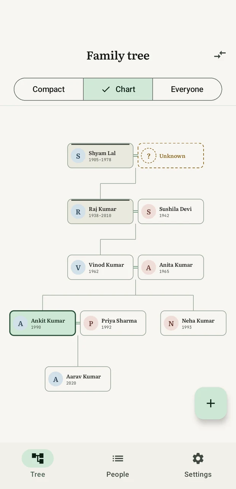
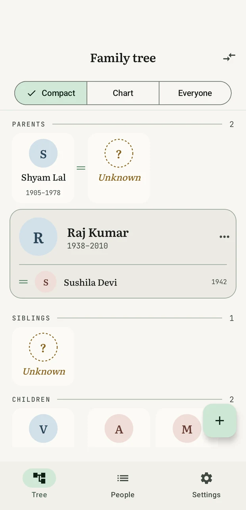
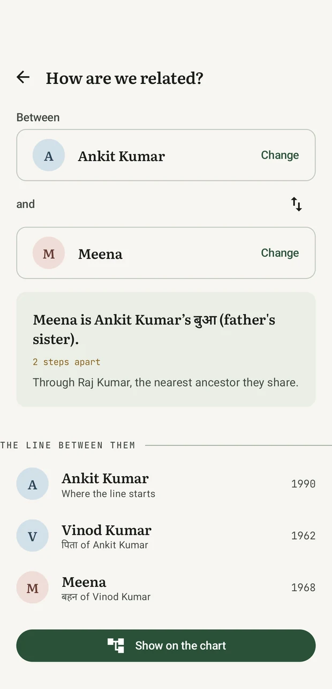
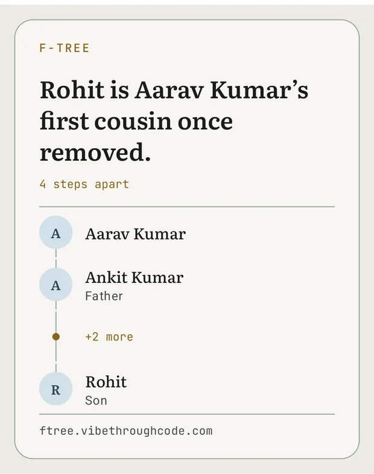
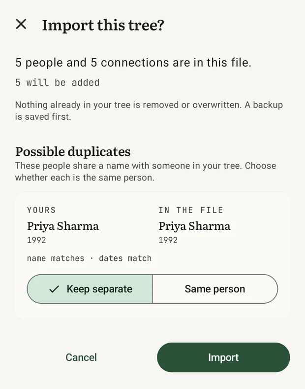

<div align="center">


# f-tree

### Your family tree — including the people nobody can name.

**A free, offline, open-source family tree app for Android.**
Ask how any two people are related and it names the relationship, in English or Hindi, and draws the line between them.

**No account. No server. No analytics. Nothing leaves your phone.**

<br>

[](https://github.com/thisisankit27/f-tree/releases/latest)
[](https://github.com/thisisankit27/f-tree/releases)
[](https://github.com/thisisankit27/f-tree/stargazers)
[](LICENSE)

[](https://github.com/thisisankit27/f-tree/actions/workflows/ci.yml)
[](#install)
[](https://kotlinlang.org)
[](https://developer.android.com/compose)
[](#privacy-the-short-version)
[](CONTRIBUTING.md)

<br>

### [⬇️ Download the APK](https://github.com/thisisankit27/f-tree/releases/latest) · [🌐 Website](https://ftree.vibethroughcode.com/) · [🧪 Try it in your browser](https://ftree.vibethroughcode.com/playground/) · [📖 Docs](docs/)

<br>





<sub><i>Chart · Compact · Hindi kinship terms</i></sub>

</div>

<br>

---

## Why this exists

Every family tree app assumes you know who everybody is. Real families do not work that way. There
is always a great-grandmother whose name nobody wrote down, an uncle nobody can place, and a cousin
whose exact relationship starts an argument at every wedding.

f-tree is built around those gaps instead of around a form you have to fill in completely.

|  | |
|---|---|
| 🕳️ **A person needs no name.** | A blank person is a valid *unknown person* — the grandfather's brother nobody remembers — and can be named years later without disturbing a single relationship. |
| 🔗 **A graph, not a tree.** | Multiple spouses, children across marriages, half-siblings, adoption, step-relations and unknown ancestors all work without special cases. |
| ❓ **"How are we related?"** | Pick any two people. f-tree names it — *first cousin once removed*, *great-great-grandfather* — and lists every person the line runs through. It walks marriages as well as blood, because "my wife's mother" is what people actually ask. |
| 🇮🇳 **Hindi kinship, done properly.** | Hindi has five words where English has "uncle". Your mother's brother is **मामा**, your father's younger brother **चाचा**, his wife **चाची**. Not a translation — a different model of the family. |
| 📴 **Genuinely offline.** | No account, no login, no backend, no sync, no analytics. Two permissions exist, both only for the opt-in updater. |
| 🤝 **Sharing that merges, never overwrites.** | Send one branch as a small file over WhatsApp. The recipient imports it and it *merges* into their tree. The worst an import can do is add a duplicate you can then merge. |

<br>

<div align="center">

&nbsp;&nbsp;

</div>

<br>

---

## Install

**[⬇️ Download the latest APK](https://github.com/thisisankit27/f-tree/releases/latest)** — Android 8.0 (Oreo) or newer, about 2 MB.

It is not on the Play Store, so Android will ask you to allow installing from your browser or file
manager once. The [website](https://ftree.vibethroughcode.com/) walks through it with the exact
wording your phone shows, and publishes the SHA-256 of every release so you can check what you
downloaded:

```bash
sha256sum f-tree-0.7.0.apk
```

Once installed, **updates can happen in place** — an opt-in setting checks GitHub for a newer
release and installs it over the running copy, so upgrading keeps your tree instead of costing an
export and an import. It is off until you switch it on, and it verifies the download's hash,
package name and signing certificate before it installs anything. See
[Updating in place](docs/architecture.md#updating-in-place).

### Try it without installing anything

The **[browser viewer](https://ftree.vibethroughcode.com/playground/)** opens an exported `.ftree`
and draws the whole family at once — every generation, and the people no relationship reaches.
There is a sample family loaded on the page. Your file is never uploaded; it is read in the tab.

### Build from source

```bash
git clone https://github.com/thisisankit27/f-tree.git
cd f-tree
./gradlew assembleDebug
```

JDK 17+ and the Android SDK. Full instructions in [docs/building.md](docs/building.md).

<br>

---

## What you get

<table>
<tr><td width="50%" valign="top">

**Three views of one family**

*Compact* reads the family as text — generations down the page, a tap to walk to anybody, no
pinching and nothing that needs a steady hand. *Chart* draws the same people with pan, zoom and
tap-to-recentre. *Everyone* draws the entire tree at once. Compact and Chart share one centre, so
switching never loses your place.

**A relation finder that answers real questions**

The word for it *and* the chain of people it runs through — which is the form that can also answer
the relationships English has no word for. On a real 148-person tree it names 55% of all 21,756
ordered pairs; the rest read their answer off the chain.

**Faces on the chart**

Every card carries a portrait — the square you framed, or a coloured initial when there is no
photograph. Photographs can be switched off on a very large tree without a single card moving.

</td><td width="50%" valign="top">

**Export and import as one `.ftree` file**

A documented ZIP. Every field optional, unknown keys ignored, so a file written by a future release
still opens. [Format spec →](docs/ftree-format.md)

**Share one person's family**

Tap somebody and send their household — their partner, their children, everyone below them. The
people *above* them stay behind. That is also how you graft a relative's branch onto yours: import
it, then marry the two families together with one relationship.

**Share an answer as a picture**

A relationship can be sent as a card rather than a file, because chat apps quietly drop the message
that comes with a document but show it beside an image.

**Accessible by design**

The canvas charts cannot be read by a screen reader, so *Compact* exists: the same family, composed
rather than painted, at any text size, spoken aloud, one tap per person.

</td></tr>
</table>

<br>

---

## Privacy — the short version

| Question | Answer |
|---|---|
| Where is my family tree stored? | On your phone, in the app's own storage. Nowhere else. |
| Is there an account or a login? | No. There is nothing to log in to. |
| Is there a server? | No. There is no backend to have one with. |
| Analytics, crash reporting, ads? | None, in the app or on the website. |
| What permissions does it ask for? | `INTERNET` and `REQUEST_INSTALL_PACKAGES` — both only for the opt-in updater, which refuses to make a request while the setting is off. |
| Does the browser viewer upload my file? | No. It is read in the tab. |
| Can I get my data out? | Any time, as a `.ftree` — a ZIP with plain JSON in it. [Documented here.](docs/ftree-format.md) |

The updater is the only code in the app that opens a socket, and it is deliberately kept in one
package (`update/`) so that claim is checkable by reading rather than by trust.

<br>

---

## Documentation

| | |
|---|---|
| ❓ [**FAQ**](docs/faq.md) | Where the data lives, what leaves the phone, how merging behaves, and what happens when you update |
| 🏗️ [**Architecture**](docs/architecture.md) | How the graph, the chart layout, the kinship rules and the photo pipeline work — and why |
| 📦 [**The `.ftree` format**](docs/ftree-format.md) | The file spec, what travels when you share a branch, and the merge rules |
| 🗂️ [**Data model**](docs/data-model.md) | Tables, fields and migrations |
| 🇮🇳 [**Hindi kinship**](docs/kinship-hindi.md) | The term list and the rules that pick between them |
| 🔤 [**Fonts**](docs/fonts.md) | Literata and JetBrains Mono, and why they are bundled |
| 🔨 [**Building & releasing**](docs/building.md) | Build, run, test, sign, tag, ship |
| 🌐 [**Site & browser viewer**](docs/site.md) | The landing page and the dependency-free `.ftree` reader |
| 🤝 [**Contributing**](CONTRIBUTING.md) | Good first issues, project shape, and how a change gets reviewed |
| 🔒 [**Security policy**](SECURITY.md) | How to report a vulnerability |
| 📜 [**Changelog**](CHANGELOG.md) | What changed in each release |

<br>

---

## Contributing

Contributions are very welcome, and the project is small enough to hold in your head in an
afternoon. The parts most worth reasoning about — chart layout, kinship rules, duplicate matching —
are **pure functions over plain data**, so they are tested on the JVM without a device and are the
easiest place to start.

Especially wanted:

- 🌏 **Kinship terms in another language.** Bengali, Marathi, Gujarati, Punjabi, Tamil and Telugu
  are structurally covered by the existing path model — each is a word list plus a small rules
  file. This needs a native speaker more than it needs an Android developer.
- 🐛 **Real families that break the layout.** The chart is tested against invented awkward cases;
  actual ones are better.
- ♿ **Accessibility testing** with TalkBack and large text sizes.
- 📝 **Documentation and translation** of anything on this page.

Start with [CONTRIBUTING.md](CONTRIBUTING.md) and the
[good first issues](https://github.com/thisisankit27/f-tree/labels/good%20first%20issue).

<br>

---

## Deliberately not built

- **GEDCOM import/export.** A large format for a lightweight app; the documented `.ftree` schema
  covers sharing between users of this app.
- **Transactional undo of an import.** A backup file the user can re-import covers the same need
  far more simply, and cannot itself go wrong.
- **A Hindi interface.** Only the family *words* change with the setting. Translating the buttons
  and error messages is a separate job needing a fluent reviewer, and a half-translated app reads
  worse than an English one.
- **Cloud sync.** The absence is the feature.

<br>

---

## Licence

[MIT](LICENSE) — use it, change it, ship it; just keep the copyright notice.

The bundled fonts (Literata, JetBrains Mono) are separately licensed under the SIL Open Font
Licence 1.1. Their licence texts ship inside the app and are surfaced on its About screen.

<br>

<div align="center">

**If f-tree is useful to you — or if the idea of a family tree with room for the people nobody can
name is one you want to exist — a ⭐ helps other families find it.**

[⭐ Star this repo](https://github.com/thisisankit27/f-tree) · [⬇️ Download](https://github.com/thisisankit27/f-tree/releases/latest) · [🌐 ftree.vibethroughcode.com](https://ftree.vibethroughcode.com/) · [💬 Discussions](https://github.com/thisisankit27/f-tree/discussions)

<sub>Built by <a href="https://github.com/thisisankit27">Ankit Srivastava</a> · <a href="https://ftree.vibethroughcode.com/">ftree.vibethroughcode.com</a></sub>

</div>
